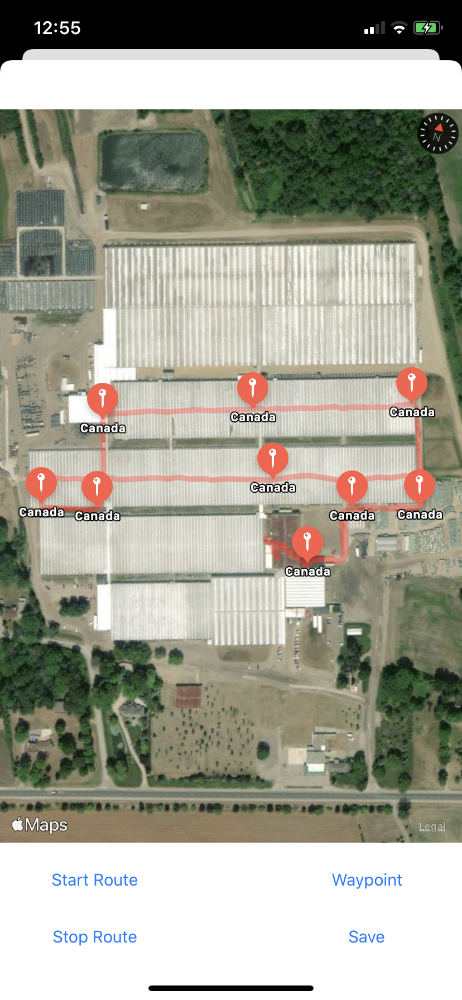
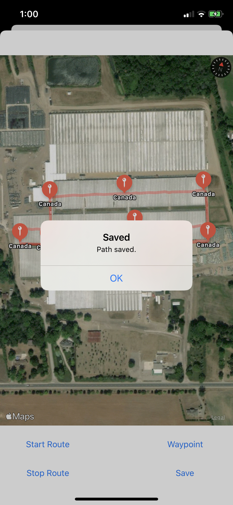

# location-tracker-ios

## Summary

Travel and trace a route on iOS with waypoints. Save route name, route, and waypoints to device using CoreLocation and mongoDB database using a Nodejs backend deployed on Azure.

